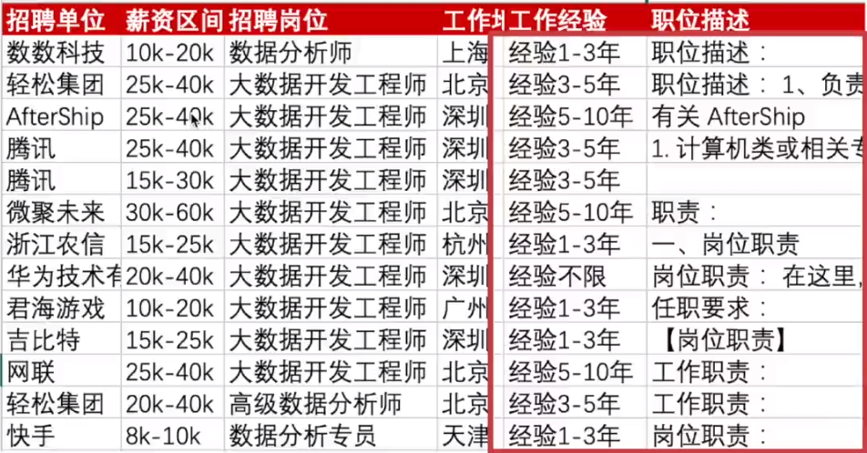
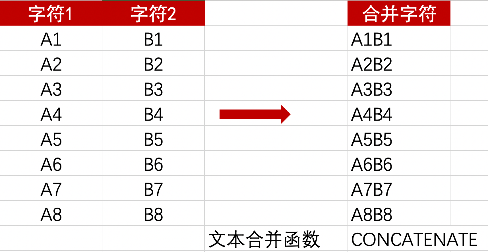

# 01-文本函数

## 1. 目标

对 [文本函数.xlsx](文本函数.xlsx) 进行如下操作：

1. 文本提取
2. 文本替换
3. 数据验证

## 2. 解析

### 1. 文本提取

上面标题已经有经验两个字，那下面的数据我们需要**去掉：经验** 两字，留下时间即可。即：

| 经验1-3年 | 1-3年 |
| --------- | ----- |

### 2. 文本替换

在进行数据存储时，出现问题，存入了数字 1，而数字 1代表：本科及以上。我们需要替换一下。

### 3. 数据验证

我们要看哪个岗位里面包含：数据分析职位，包含则放回 True，不包含则返回 False。

## 3. 总结

1. 第一个问题使用：MID 即可；
    1. Mid >>> 提取文本
2. 第二个问题使用：SUBSTITUTE；
    1. Substitute >>> 替换文本
3. 第三个问题使用：find 查找，然后编写函数使用：ISNUMBER
    1. Find >>> 验证文本

## 4. 作业

**【学习任务】使用文本函数进行数据清洗**

### 任务描述

对招聘数据完成数据清洗工作，针对**工作经验**和**职位描述**这两列数据去除以下字符：

- 经验
- 职位描述：
- 岗位职责：
- 工作职责：

也就是将这些前缀全部去掉，只保留后面的文本数据：

答案文件：[去除制定字符.xlsx](去除制定字符.xlsx)

## 5. 扩展

### 文本合并函数

## 5. 更新频率

就不立下什么 flag 了，我随性更新，你们想持续学的，就持续关注我公众号即可，如果愿意就分享一下咯。

## 6. 公众号：AI悦创

