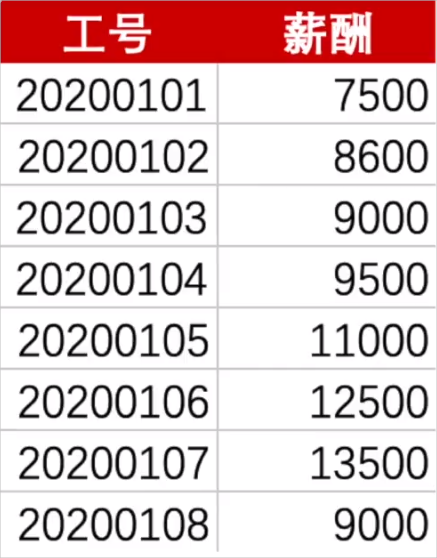

# 02-数学函数

## 1. 文本函数与

## 1. 目标

熟悉操作 Excel 函数，并操作求值。操作文件：[数学函数.xlsx](数学函数.xlsx)

## 2. 作业

**学习任务】使用数学函数计算集中趋势指标**

### 任务描述

对 [作业：计算集中趋势指标.xlsx](作业：计算集中趋势指标.xlsx) 进行如下操作：

使用数学函数计算文件中这组数据的集中趋势指标，包括平均值、中位数、众数

## 3. 更新频率

就不立下什么 flag 了，我随性更新，你们想持续学的，就持续关注我公众号即可，如果愿意就分享一下咯。

## 4. 公众号：AI悦创

## 5. 上一篇

