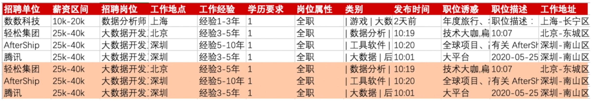

# 03-处理重复函数

## 1. 数据预处理的重要性

你好，我是悦创。

前面两节课，我们学习了文本函数、数学函数。这节课我们来学一下，如何处理重复数据。也就是进行对数据进行预处理。

在真实的数据分析工作中，数据的预处理就是指：**清洗、格式化、去重、排序、基础计算**

这个数据预处理，会占数据分析的 50% 以上的时间，并且这个时间，只多不少！

因为后续的统计和图表的工作，一般都有现成的工具来实现。

所以，**对于数据的预处理，能够形成自己一套的工作流程，是非常有必要的。**

——这个就需要大家：多学、多练。来达成这样的自我预处理流程。

**那数据预处理，为什么这么重要呢？**

——如果你对预处理不到位，比如：缺失值、异常值都没有进行处理，那你的 **数据准确性** 就没有办法保证。那这样就会造成错误的 统计结果与结论

## 2. 数据预处理包含哪些内容呢？

- 数据的清理
    - 缺失值
    - 离群值/异常值
    - 重复值

如果你的数据是从多个地方来源的，或者多张表，或者数据库获取的。这样的话，你还需要考虑 **数据的合并、汇总、集成**。

对于缺失值和离群值来说，我们一般会按情况，使用：**删除、均值填充** 。具体的判断方式和处理手段，以后有时间我会与你们分享。

**对于重复的数据，我们要如何处理呢？**

## 3. 如何定位重复数据

首先，我们要学会定位重复数据

