# 03-处理重复函数

## 1. 数据预处理的重要性

你好，我是悦创。

前面两节课，我们学习了文本函数、数学函数。这节课我们来学一下，如何处理重复数据。也就是进行对数据进行预处理。

在真实的数据分析工作中，数据的预处理就是指：**清洗、格式化、去重、排序、基础计算**

这个数据预处理，会占数据分析的 50% 以上的时间，并且这个时间，只多不少！

因为后续的统计和图表的工作，一般都有现成的工具来实现。

所以，**对于数据的预处理，能够形成自己一套的工作流程，是非常有必要的。**

——这个就需要大家：多学、多练。来达成这样的自我预处理流程。

**那数据预处理，为什么这么重要呢？**

——如果你对预处理不到位，比如：缺失值、异常值都没有进行处理，那你的 **数据准确性** 就没有办法保证。那这样就会造成错误的 统计结果与结论

## 2. 数据预处理包含哪些内容呢？

- 数据的清理
    - 缺失值
    - 离群值/异常值
    - 重复值

如果你的数据是从多个地方来源的，或者多张表，或者数据库获取的。这样的话，你还需要考虑 **数据的合并、汇总、集成**。

对于缺失值和离群值来说，我们一般会按情况，使用：**删除、均值填充** 。具体的判断方式和处理手段，以后有时间我会与你们分享。

**对于重复的数据，我们要如何处理呢？**

## 3. 如何定位重复数据

首先，我们要学会定位重复数据

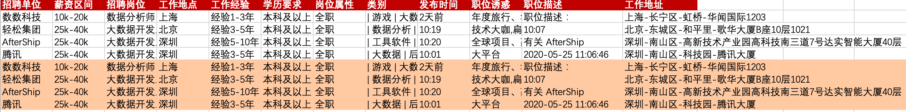

当招聘数据出现一模一样的重复数据时，我们就需要进行去重处理。比如我们可以看到 **轻松集团** 有两条一模一样的招聘信息。那说明有可能是前期抓取或者前期收集数据时的错误。——这个数据我们不应该进入统计。那要是数据量很少的时候，我们可以 **手动删除** 这些重复数据。

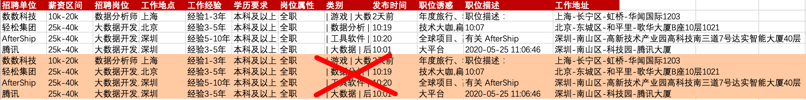

[**如何定位重复数据.xlsx**](视频操作文件/如何定位重复数据.xlsx)

**那如果你的数据量比较大，如何去掉重复数据呢？**

## 4. 针对海量数据，如何快速定位？

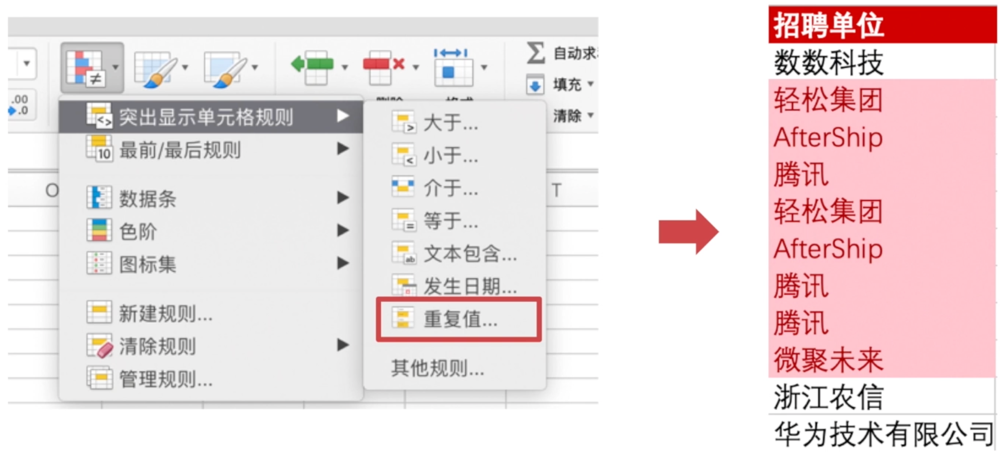

接下来，我们可以试一试操作数据表中 A 列公司的重复。[**针对海量数据，如何快速定位？01.xlsx**](视频操作文件/针对海量数据，如何快速定位？01.xlsx)

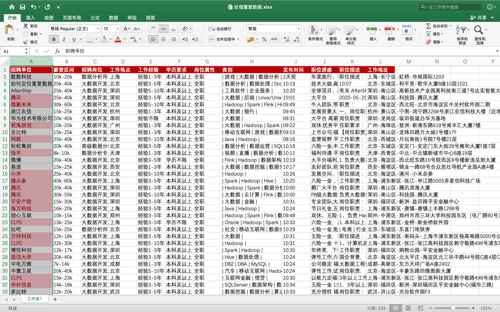

**出现红色的部分就是，在当前列该公司不止出现一次。**

我可以先对数据进行筛选，然后删掉红色色块行。

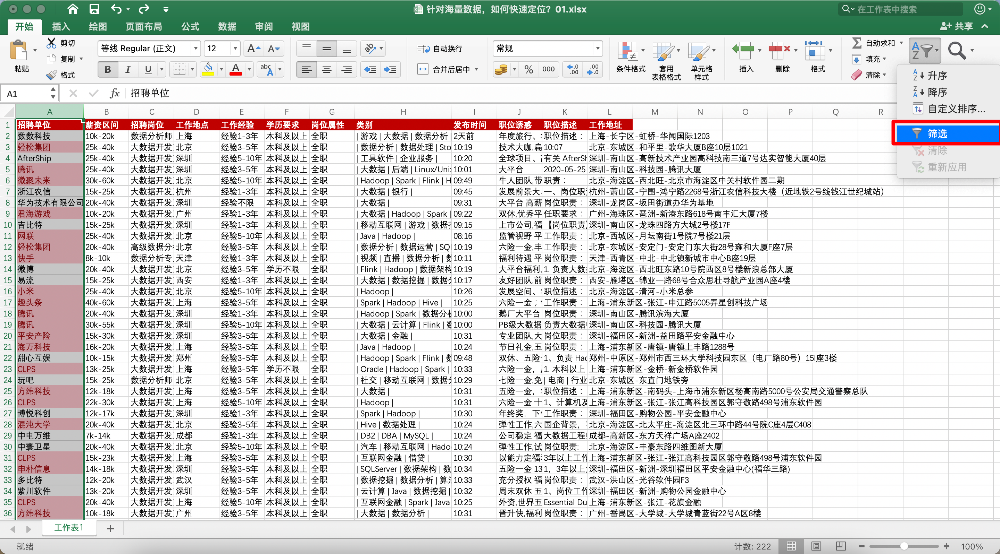

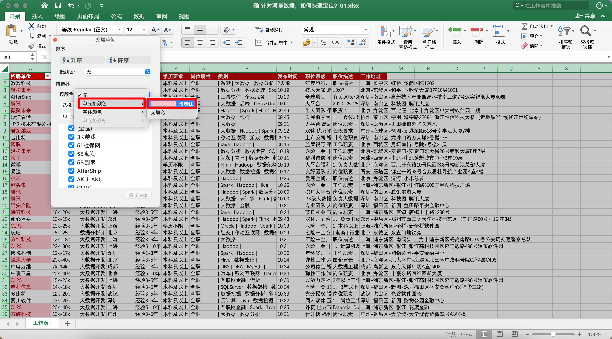

删除键即可。

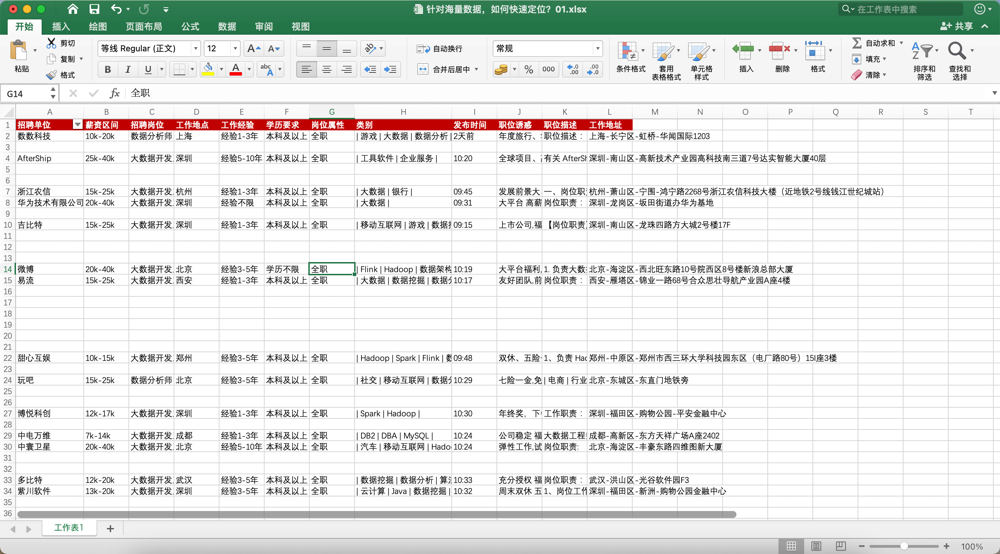

接下来就是删除 Excel 的空行即可。[Excel 批量删除空白行，你用了 2 小时，同事 3 分钟就搞定了](https://www.aiyc.top/1760.html)：[https://www.aiyc.top/1760.html](https://www.aiyc.top/1760.html)

## 5. 筛选整行重复的数据

那上面只是单独的一列的重复值的操作，那我们想要筛选出整一行重复的，要如何操作呢？

所以，这个时候我们可以扩大数据定位，首先我们全选数据的定位：control + a，接下来按如下操作：[**5. 筛选整行重复的数据.xlsx**](视频操作文件/5. 筛选整行重复的数据.xlsx)

你会发现这里面有大量的数据都标红了，导致你会很难鉴别哪条数据和哪条数据是重复的。这个是为什么呢？——因为对于条件格式，它是通过去对比，我目前选定的单元格，和其他所有单元格是否有和它一直的。一旦有一致的，就处理标红。这显然是不能达到我们的需求的。

我们来介绍第二种方法，我们可以先清除格式一下：

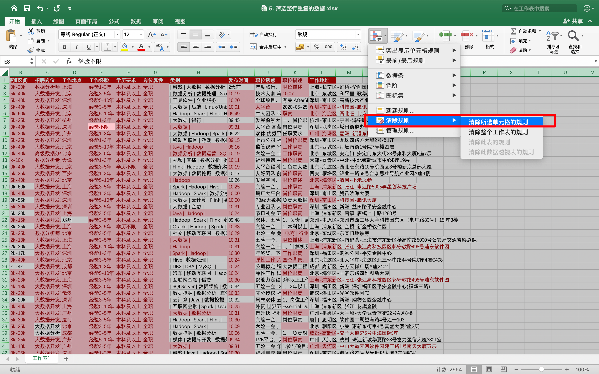

这里我故意复制几个重复数据行：

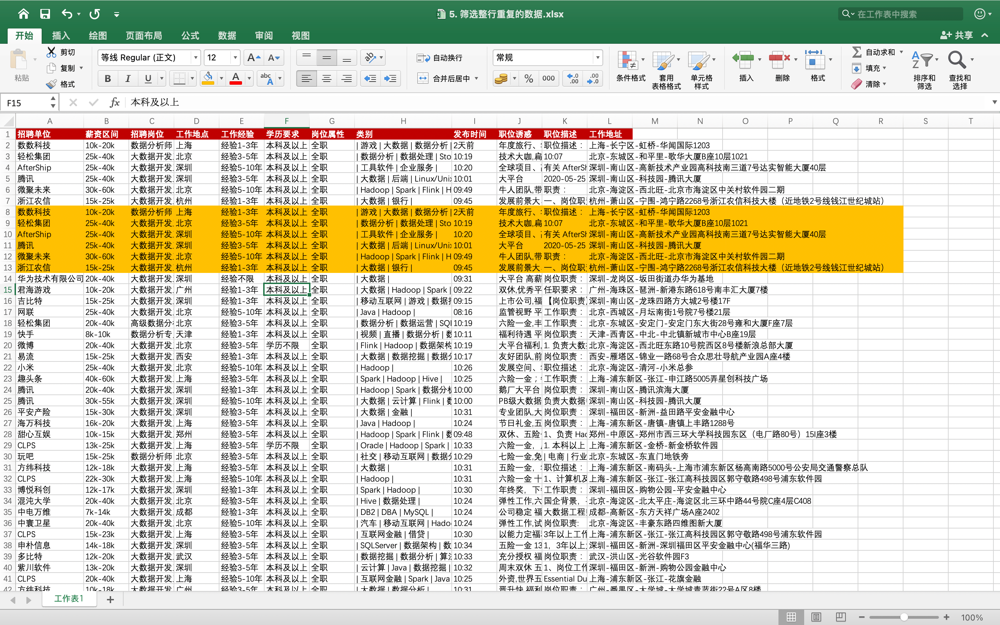

我们可以使用如下方法：

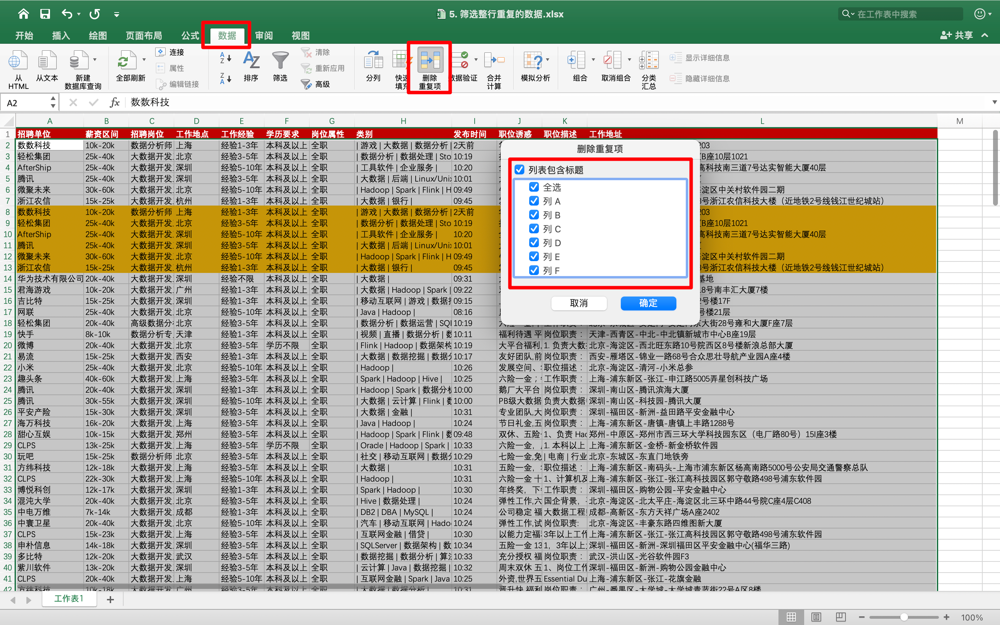

这个时候，如果你只是选一列，进行删除的话，会出现一个问题：也就是有的公司有可能发了多个职位，这样的重复项是允许的，但是被我们删除了。

我们想要的是针对所有值的重复列进行删除筛选。除非它是所有列相同，我们才需要删除。所以，我们需要勾选 **全选** 点击确定后：

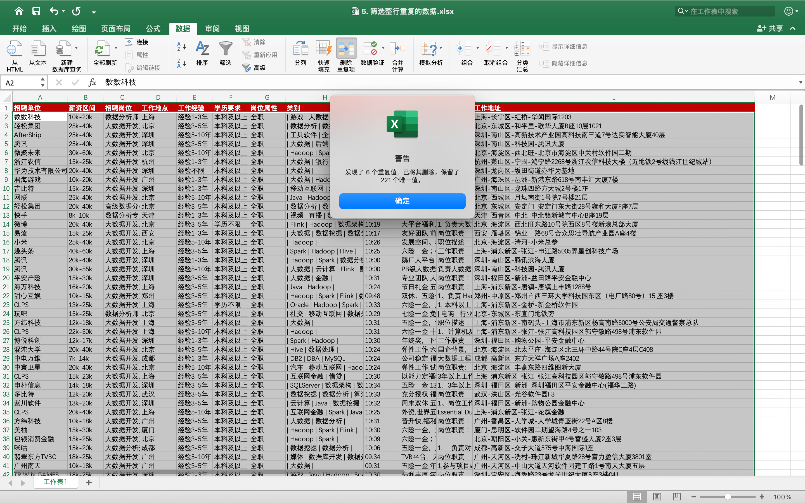

可以看到，刚刚标有颜色的几行都被删除了。

## 6. 章节回顾

- 数据预处理流程
    - 数据的清洗
    - 数据的整合
- 定位重复项
    - 开始菜单 >>> 单元格规则 ；
    - 缺点：只能对单列的重复项进行定位，并且需要手动删除；
- 去除重复项
    - 数据菜单 >>> 去除重复项；
    - 多列的重复项定位和自动删除；

## 7. 课后作业

### 任务描述

对提供的以下招聘数据进行去重，去重的字段包括：**招聘单位、薪资区间、招聘岗位、工作地点、工作经验**。也就是说如果这几个字段的数据是一样的，需要进行删除，并回答去重后的行数是多少？

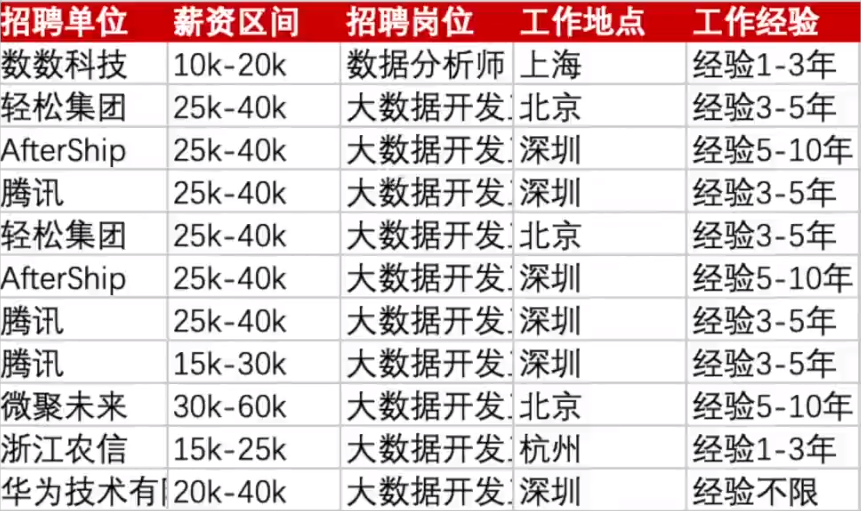

原始数据点击上方的的作业素材进行下载。

> **Tips**：作业的参考答案可以在代码仓库中找到～

## 公众号：AI悦创

